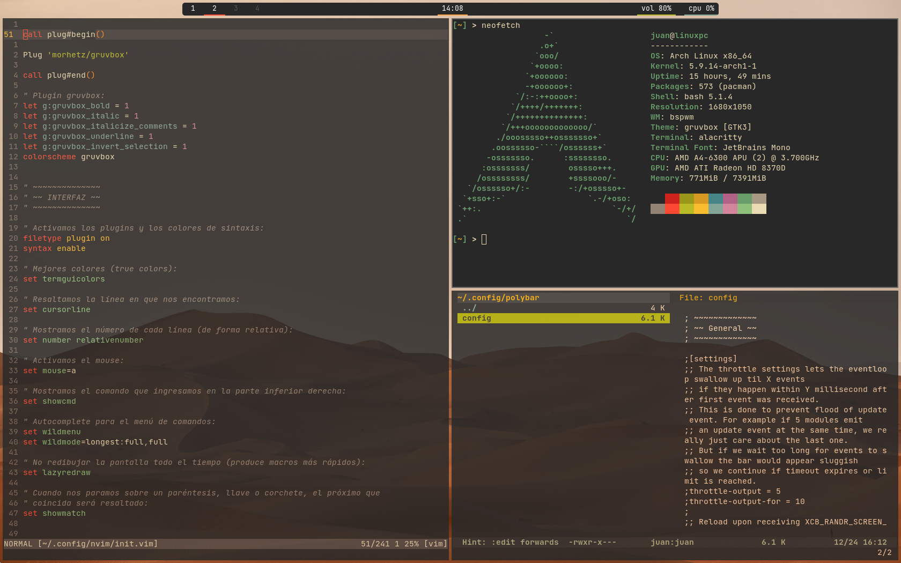
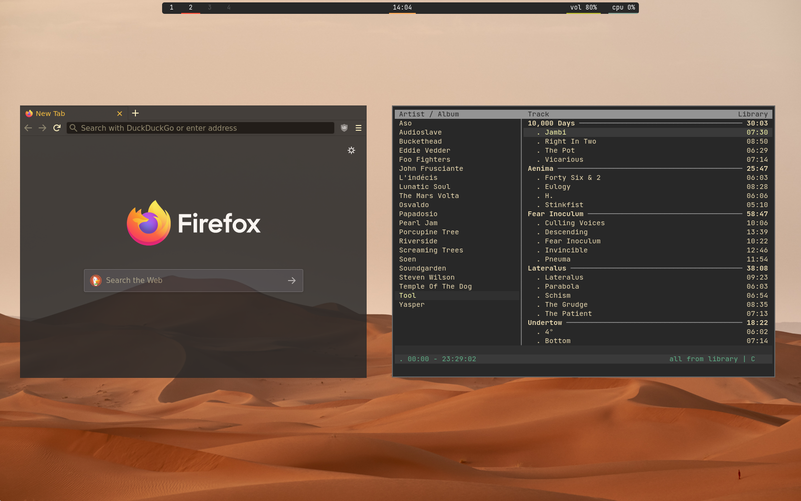
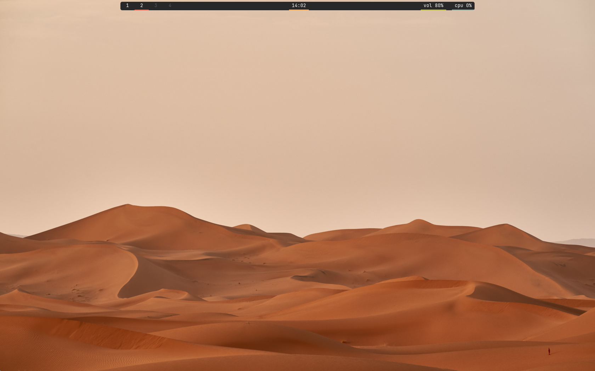

# dotfiles
Este es mi repositorio personal de dotfiles. Contiene las configuraciones actuales de mi sistema.

Si bien hace mucho tiempo que uso GNU/Linux, todavía sigo aprendiendo, así que este es un trabajo en progreso. 

Cualquiera es libre de aportar ideas o sugerir cambios. :+1:

This is my personal dotfiles repository. It contains my current system settings.

Although I have been using GNU/Linux for a long time, I am still learning, so this is a work in progress. 

Anyone is free to contribute ideas or suggest changes. :+1:

## Imágenes (pictures):

### Tiling

### Floating

### Clean

